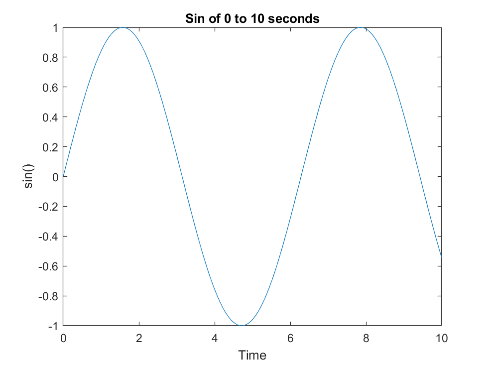
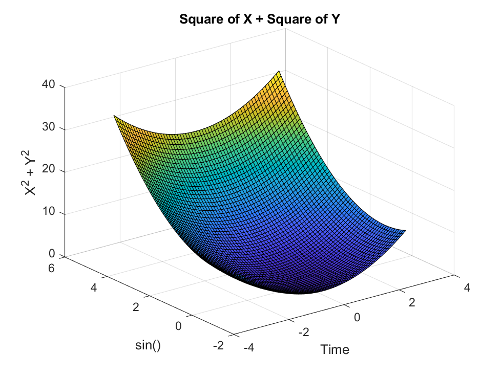
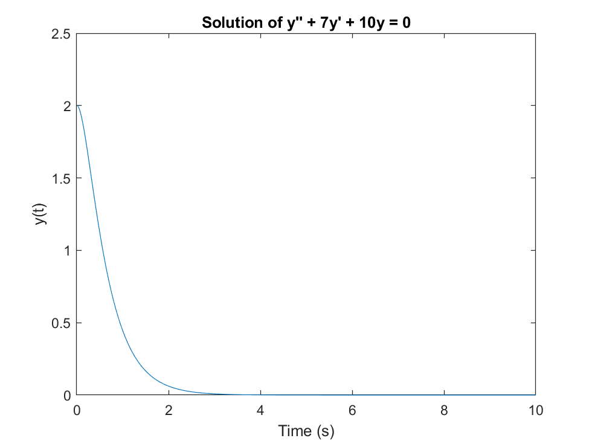
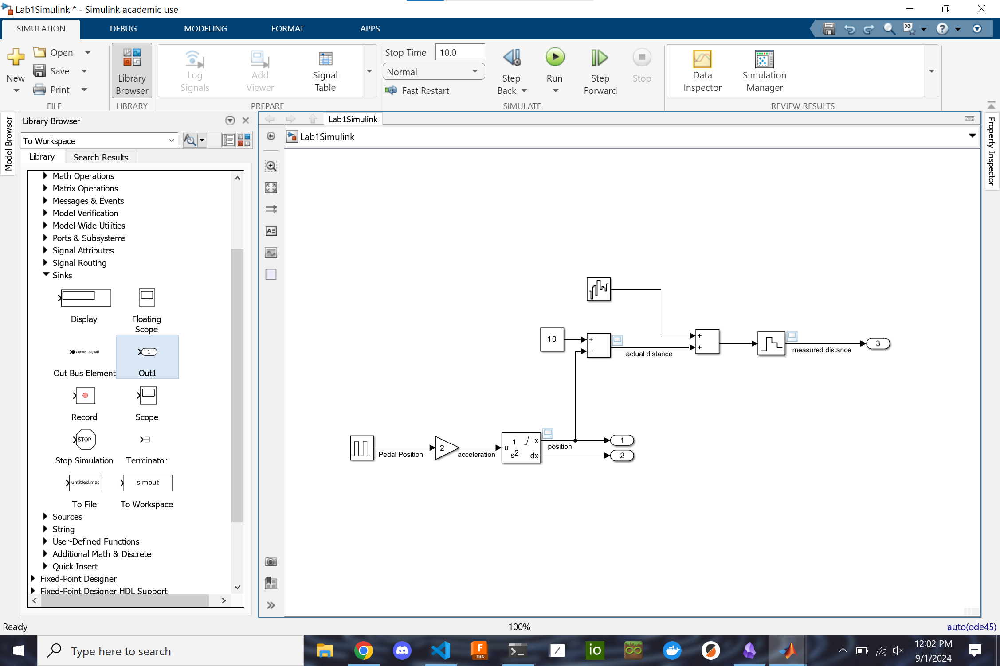
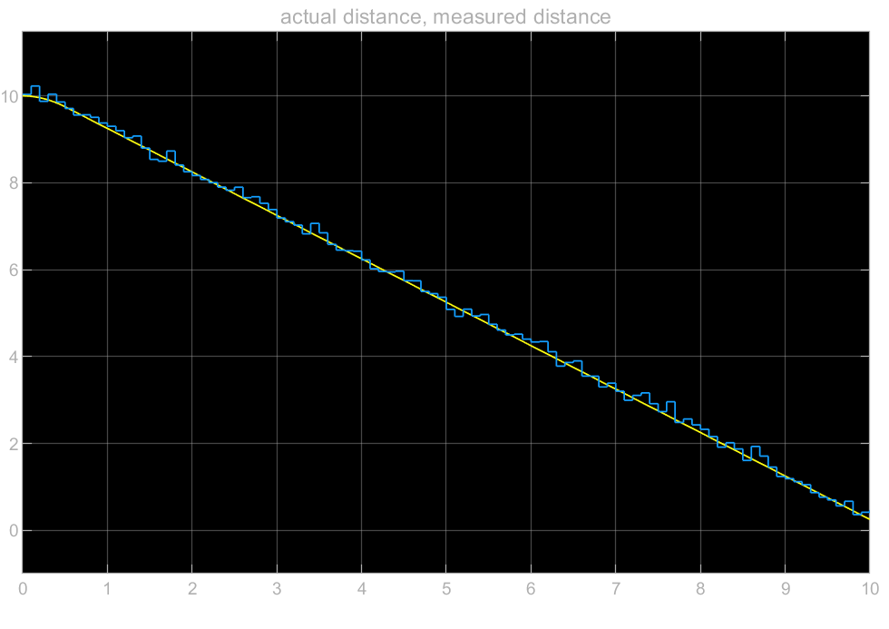

# Lab 1

## Distribution of work

| Name  | Work(%) |
|-------|---------|
| Nate  | 33%     |
| Matt  | 33%     |
| Casey | 33%     |

## Lab topic

In this lab we cover the basics of control related functions and operations in MATLAB and using ODE’s to model systems and solve them. We then looked into using Simulink to model a basic moving car system and simulate inaccurate sensors with signal generators and various other logic blocks.

## MATLAB Tutorial

### Q4

```matlab
% Part A
A = randn(3,3);
B = eye(3);
C = A + B;
D = C*[2;5;9];

% Part B
figure;
t = 0:0.01:10;
y = sin(t);
plot(t,y);
hold on;
title('Sin of 0 to 10 seconds');
xlabel('Time');
ylabel('sin()');
hold off;

% Part C
figure;
[x,y] = meshgrid(-3:0.1:3, -1:0.1:5);
z = x.^2 + y.^2;
surf(x,y,z);
hold on;
title('Square of X + Square of Y');
xlabel('Time');
ylabel('sin()');
zlabel('X^2 + Y^2');
hold off;

% Part D
s = tf('s');
func = s^4 + 3*s^3 - 15*s^2 - 2*s + 9;
roots = zero(func);
```





### Q5

>dydt.m

```matlab
%helper function
function dydt = dydt(t, y)
    A = [0 1; -10 -7];
    dydt = A * y;
end
```

>Lab1Problem5.m

```matlab
%y''+7y'+10y=0
%y1=y
%y2=y'
%y1'=2
%y'2=-7y2-10y1

tspan = [0 10]; 
y0 = [2; 0.1]; % Initial conditions y(0)=2 and y'(0)=0.1
[t, y] = ode45(@dydt, tspan, y0);

% Plot the results
plot(t, y(:, 1))
xlabel('Time (s)')
ylabel('y(t)')
title('Solution of y'''' + 7y'' + 10y = 0')
```



## Simulink





## Conclusion

All in all, MATLAB and Simulink are powerful tools to simplify system simulation and calculation. In MATLAB we were able to mathematically summarize a classic spring-mass-dampener system with differential equations and their solutions, and coherently visualize them. In Simulink we were able to emulate the relationship between the gas pedal and the acceleration of the car, as well as simulate a sensor and its real world inaccuracies and visually compare its readings to actual values.
